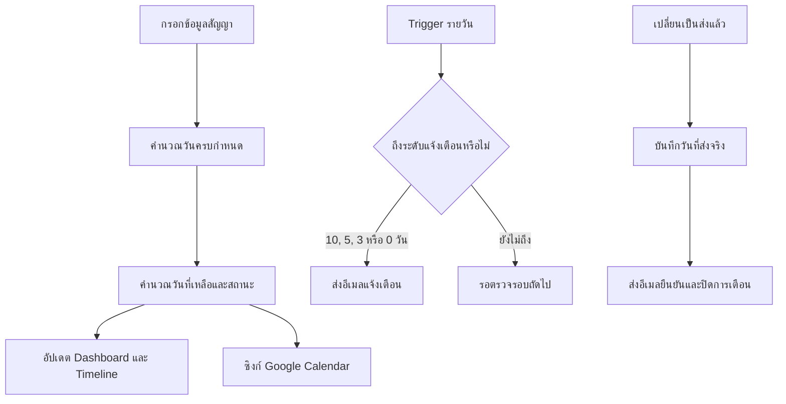

# ระบบแจ้งเตือนสัญญาจัดซื้อจัดจ้างสำหรับ Google Sheets

ระบบติดตามวันครบกำหนดของสัญญาจัดซื้อจัดจ้างบน Google Sheets พร้อมคำนวณสถานะ แจ้งเตือนทางอีเมล และเชื่อมต่อ Google Calendar โดยไม่ต้องมีเซิร์ฟเวอร์ โดเมน หรือฐานข้อมูลแยก

เหมาะสำหรับผู้ที่ต้องการใช้งานส่วนตัว หรือแจกแม่แบบให้ผู้ใช้อื่นสร้างสำเนาไปติดตั้งในบัญชี Google ของตนเอง

## จุดเด่น

- คำนวณวันครบกำหนดจากวันที่เซ็นสัญญาและจำนวนวันส่งมอบ
- แจ้งเตือนก่อนครบกำหนด 10, 5, 3 วัน และวันครบกำหนด
- ส่งอีเมลไปยัง Gmail, Outlook และอีเมลองค์กร
- ส่งอีเมลยืนยันเมื่อเปลี่ยนสถานะการส่งมอบเป็น `ส่งแล้ว`
- บันทึกวันที่ส่งจริงให้อัตโนมัติหากยังไม่ได้กรอก
- แสดงจำนวนวันที่เหลือและสถานะพร้อมสี
- แสดง `ส่งก่อนกำหนด ... วัน`, `ส่งตรงกำหนด` และ `ส่งล่าช้า ... วัน`
- สร้างและอัปเดตกิจกรรมใน Google Calendar
- มี Dashboard สรุปภาพรวมและ Timeline แสดงช่วงสัญญา
- เพิ่มแถวพร้อมใช้ครั้งละ 50 หรือ 100 แถว
- เก็บประวัติการส่งอีเมล การแก้ไข และข้อผิดพลาดของระบบ
- ไม่มีค่าเซิร์ฟเวอร์หรือค่าโดเมน

## ภาพรวมการทำงาน

## โครงสร้างไฟล์

| ไฟล์ | หน้าที่ |
|---|---|
| `Contract_Reminder_GoogleSheets_Template.xlsx` | แม่แบบที่ล้างข้อมูลแล้ว สำหรับนำเข้า Google Sheets |
| `Code.gs` | โค้ด Google Apps Script ของระบบ |
| `appsscript.json` | Manifest และขอบเขตสิทธิ์ที่ Apps Script ต้องใช้ |
| `GUIDE_TH.md` | คู่มือติดตั้งและแก้ปัญหาภาษาไทยฉบับเต็ม |
| `.gitignore` | ป้องกันไฟล์ Credential, Key, Token และไฟล์ชั่วคราว |

## แท็บในแม่แบบ

| แท็บ | รายละเอียด |
|---|---|
| `Dashboard` | แสดงจำนวนรายการทั้งหมด รายการใกล้ครบกำหนด เกินกำหนด และส่งแล้ว |
| `รายการสัญญา` | ตารางหลักสำหรับกรอกและติดตามข้อมูลสัญญา |
| `ปฏิทิน Timeline` | แสดงเส้นช่วงเวลาตั้งแต่วันที่เซ็นถึงวันครบกำหนด |
| `ตั้งค่า` | กำหนดเวลา Calendar ID ชื่อผู้ส่ง และตัวเลือกของระบบ |
| `ประวัติระบบ` | บันทึกการทำงาน การส่งอีเมล และข้อผิดพลาด |

## คอลัมน์ที่ผู้ใช้กรอก

| คอลัมน์ | วิธีกรอก |
|---|---|
| ชื่อบริษัท | ชื่อผู้ขายหรือคู่สัญญา |
| เบอร์ติดต่อ | เบอร์โทรศัพท์สำหรับติดตามงาน |
| ชื่อรายการ | ชื่อพัสดุ งาน หรือบริการ |
| อีเมลแจ้งเตือน | รองรับหลายอีเมล โดยคั่นด้วยเครื่องหมายจุลภาค |
| วันที่เซ็นสัญญา | วันที่เริ่มต้นสำหรับคำนวณกำหนดส่ง |
| กำหนดส่ง (วัน) | จำนวนวันตามเงื่อนไขในสัญญา |
| วันที่ส่งจริง | กรอกเองหรือปล่อยให้ระบบบันทึกเมื่อเลือก `ส่งแล้ว` |
| การส่งมอบ | Dropdown `ยังไม่ส่ง` หรือ `ส่งแล้ว` |
| หมายเหตุ | รายละเอียดเพิ่มเติม |

คอลัมน์วันที่ครบกำหนด วันที่เหลือ สถานะ และลิงก์ Google Calendar คำนวณอัตโนมัติ ส่วนคอลัมน์ N–X เป็นคอลัมน์ระบบและไม่ควรแก้ไขเอง

## สถานะอัตโนมัติ

| เงื่อนไข | สถานะ |
|---|---|
| เหลือมากกว่า 10 วัน | อยู่ระหว่างดำเนินการ |
| เหลือ 6–10 วัน | ใกล้ครบกำหนด |
| เหลือ 4–5 วัน | ต้องติดตาม |
| เหลือ 1–3 วัน | เร่งดำเนินการ |
| ถึงวันกำหนด | ครบกำหนดวันนี้ |
| เลยกำหนดและยังไม่ส่ง | เกินกำหนด ... วัน |
| ส่งก่อนวันครบกำหนด | ส่งก่อนกำหนด ... วัน |
| ส่งในวันครบกำหนด | ส่งตรงกำหนด |
| ส่งหลังวันครบกำหนด | ส่งล่าช้า ... วัน |

## วิธีติดตั้ง

### 1. นำเข้าแม่แบบ

1. ดาวน์โหลด Repository ด้วย `Code > Download ZIP` หรือ Clone Repository
2. อัปโหลด `Contract_Reminder_GoogleSheets_Template.xlsx` ไปยัง Google Drive
3. เปิดไฟล์ด้วย Google Sheets
4. เลือก `ไฟล์ > บันทึกเป็น Google ชีต` เพื่อแปลงเป็น Google Sheets จริง

### 2. ติดตั้ง Apps Script

1. เปิด `ส่วนขยาย > Apps Script`
2. ลบโค้ดตัวอย่างใน `Code.gs`
3. คัดลอกเนื้อหาจาก `Code.gs` ใน Repository ไปวาง
4. เปิด `การตั้งค่าโปรเจกต์`
5. เปิดตัวเลือกแสดงไฟล์ Manifest `appsscript.json`
6. แทนที่ Manifest เดิมด้วย `appsscript.json` จาก Repository
7. กดบันทึก

### 3. อนุญาตสิทธิ์และสร้าง Trigger

1. เลือกฟังก์ชัน `setupSystem`
2. กด `Run`
3. เลือกบัญชี Google ที่ต้องการใช้
4. อนุญาตสิทธิ์ Spreadsheet, Calendar, การส่งอีเมล การสร้าง Trigger และอีเมลผู้ใช้
5. กลับไปที่ Google Sheets แล้วรีเฟรชหน้า

เมื่อติดตั้งสำเร็จ จะมีเมนู `ระบบสัญญา V2` ปรากฏใน Google Sheets

## การตั้งค่า

| รายการ | ค่าเริ่มต้น | รายละเอียด |
|---|---:|---|
| เขตเวลา | `Asia/Bangkok` | เขตเวลาสำหรับคำนวณและส่งข้อความ |
| Calendar ID | `primary` | ใช้ Google Calendar หลักของบัญชีผู้ติดตั้ง |
| ชื่อผู้ส่ง | `ระบบแจ้งเตือนสัญญา` | ชื่อที่แสดงในอีเมล |
| ชั่วโมงตรวจแจ้งเตือน | `8` | ทำงานหนึ่งครั้งภายในช่วง 08:00–08:59 |
| วันแจ้งเตือน | `10,5,3,0` | ระดับวันที่รองรับในโค้ดรุ่นนี้ |
| จำนวนแถวสูงสุด | `500` | จำนวนแถวข้อมูลที่ระบบตรวจสอบ |
| อีเมลทดสอบ | ว่าง | อีเมลสำหรับทดสอบระบบ |
| วิธีนับวัน | นับวันถัดจากวันเซ็น | เปลี่ยนเป็นนับรวมวันเซ็นได้ |
| ซิงก์ Calendar ทันที | เปิด | อัปเดตกิจกรรมเมื่อแก้ข้อมูล |
| ล้างวันที่ส่งเมื่อกลับเป็นยังไม่ส่ง | เปิด | ล้างวันที่ส่งจริงเมื่อย้อนสถานะ |
| แจ้งเตือนเมื่อเปลี่ยนเป็นส่งแล้ว | เปิด | ส่งอีเมลยืนยันการส่งมอบ |

หลังเปลี่ยน `ชั่วโมงตรวจแจ้งเตือน` ให้รัน `setupSystem` อีกครั้ง เพื่อให้ระบบลบ Trigger เดิมและสร้าง Trigger ใหม่

> Google Apps Script ไม่รับประกันนาทีที่ทำงาน หากกำหนดชั่วโมงเป็น `8` ระบบจะทำงานหนึ่งครั้งในช่วง 08:00–08:59 ไม่จำเป็นต้องตรง 08:00

## การทดสอบระบบ

1. กรอกอีเมลในช่อง `อีเมลทดสอบ` ที่แท็บ `ตั้งค่า`
2. เลือก `ระบบสัญญา V2 > ทดสอบส่งอีเมล`
3. ตรวจ Inbox และ Spam/Junk
4. เพิ่มสัญญาทดสอบในสำเนาของคุณ
5. ใช้เมนู `ตรวจและส่งแจ้งเตือนตอนนี้` เมื่อต้องการตรวจทันที

## การแจ้งเตือนทางอีเมล

- ระบบส่งอีเมลจากบัญชี Google ที่เป็นผู้ติดตั้ง Trigger
- ผู้รับสามารถเป็น Gmail, Outlook หรืออีเมลองค์กรได้
- รองรับหลายผู้รับในรายการเดียว
- ระบบบันทึกธงการส่งเพื่อป้องกันการส่งระดับเดิมซ้ำ
- เมื่อเปลี่ยนกำหนดส่ง ระบบจะรีเซ็ตธงแจ้งเตือนของแถวนั้น
- เมื่อเปลี่ยนเป็น `ส่งแล้ว` ระบบจะส่งอีเมลยืนยันเพียงครั้งเดียว

## Google Calendar

- สร้างกิจกรรมแบบทั้งวันในวันครบกำหนด
- ตั้ง Email Reminder ล่วงหน้า 10, 5 และ 3 วัน
- ตั้ง Popup Reminder ในวันครบกำหนด
- แก้ไขกิจกรรมเดิมเมื่อข้อมูลสัญญาเปลี่ยน
- ลบกิจกรรมเมื่อข้อมูลหลักไม่ครบ
- เปลี่ยนชื่อกิจกรรมและปิด Reminder เมื่อส่งแล้ว

## Dashboard และ Timeline

- แม่แบบมีแถวพร้อมใช้เริ่มต้น 500 แถว
- เพิ่มแถวได้จากเมนูครั้งละ 50 หรือ 100 แถว
- Dashboard อ้างอิงข้อมูลถึงแถว 2,000 และอัปเดตจากสูตรอัตโนมัติ
- Timeline แสดงช่วง 70 วัน โดยเปลี่ยนวันที่เริ่มต้นในช่อง `B3`

## ความปลอดภัยและการแชร์

ระบบรุ่นนี้ออกแบบให้ผู้ใช้แต่ละคนสร้างสำเนาและใช้กับบัญชีของตนเอง

- แชร์ไฟล์ใช้งานจริงเป็น `Viewer` หรือ `Commenter` หากไม่ต้องการให้ผู้อื่นแก้ข้อมูล
- หากต้องการแจกระบบ ให้แชร์แม่แบบแบบ `Viewer` หรือให้ดาวน์โหลดจาก Repository นี้
- อย่าให้สิทธิ์ `Editor` แก่ผู้ที่ไม่ควรแก้ข้อมูล เพราะ Editor สามารถเปลี่ยนสถานะและข้อมูลในตารางได้
- ห้าม Commit `.clasp.json`, `.clasprc.json`, Credential, Service Account, `.env`, Private Key, API key หรือ Token
- ห้ามอัปโหลดไฟล์ Google Sheets หรือ Excel ที่มีข้อมูลสัญญาจริง

## ความเป็นส่วนตัว

Repository นี้ไม่มีข้อมูลส่วนตัว ข้อมูลสัญญาจริง อีเมล เบอร์โทร Spreadsheet ID, Calendar Event ID, API key, Token หรือรหัสผ่านของผู้พัฒนา

ข้อมูลที่ผู้ใช้กรอกหลังติดตั้งจะอยู่ภายในบัญชี Google ของผู้ใช้แต่ละคน Repository นี้ไม่สามารถเข้าถึงข้อมูลเหล่านั้นได้

## ข้อจำกัดที่ควรทราบ

- อยู่ภายใต้โควตาการส่งอีเมลและการทำงานของ Google Apps Script
- Trigger รายวันทำงานภายในชั่วโมงที่กำหนด ไม่รับประกันนาทีเป๊ะ
- Outlook ใช้เป็นอีเมลผู้รับได้ แต่ผู้ส่งยังเป็นบัญชี Google ของผู้ติดตั้ง
- ระบบป้องกันผู้มีสิทธิ์ Editor ไม่ให้แก้ข้อมูลทั้งหมดไม่ได้ จึงควรจำกัดสิทธิ์การแชร์
- ต้องแปลงไฟล์ `.xlsx` เป็น Google Sheets ก่อนติดตั้ง Apps Script

## แก้ปัญหาเบื้องต้น

### ไม่เห็นเมนู `ระบบสัญญา V2`

รีเฟรช Google Sheets หรือรันฟังก์ชัน `onOpen` จาก Apps Script

### ส่งอีเมลไม่ได้

- ตรวจอีเมลผู้รับ
- ตรวจสิทธิ์ Apps Script
- ตรวจโควตาของบัญชีผู้ส่ง
- ตรวจแท็บ `ประวัติระบบ`

### Calendar ไม่ถูกสร้าง

- ตรวจว่า Calendar ID เป็น `primary`
- ตรวจสิทธิ์ Calendar
- กรอกชื่อบริษัท ชื่อรายการ และวันที่ให้ครบ
- ใช้เมนู `ซิงก์ Google Calendar ทั้งหมด`

### เปลี่ยนเวลาแล้วระบบยังทำงานเวลาเดิม

รัน `setupSystem` อีกครั้งเพื่อสร้าง Trigger ใหม่

## คู่มือเพิ่มเติม

อ่านขั้นตอนแบบละเอียดเพิ่มเติมได้ใน [GUIDE_TH.md](GUIDE_TH.md)
